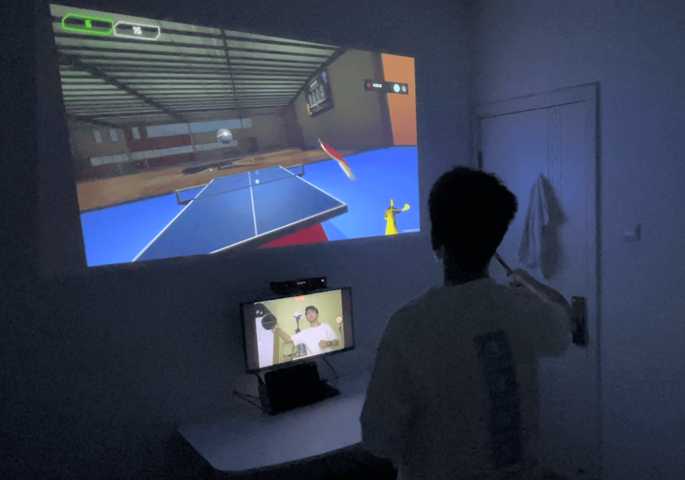

## Ping Pong Master 乒乓球接球训练系统

基于 Kinect 动作捕捉 & Unity 平台开发的虚拟仿真训练系统

### 开发它的背景

让初学者可以在家中练习乒乓球接球是有意义的，因为：1. 新冠的流行反复，室外场所限制。2. 私教和乒乓球发球器价格高。3. 家中一般不易设置乒乓球器材。因此我们希望开发一种系统，可以在家中就能进行接球训练，通过练习矫正接球动作，使用户在现实运动中也能有好的接球发挥。

### 它是什么

**这是一款虚拟乒乓球训练系统，目的是为了让初学者在家中更低限制的练习接球动作，从而提升其现实接球技能。本项目可模拟现实发球器的作用，通过发挥虚拟空间的自由程度，让发球器更灵活且可让用户获得更多训练反馈。**

为了给予用户沉浸的训练体验：1. 软件实现了用户的动作捕捉与球拍识别，画面会跟随用户眼睛注视的方向以实现第一人称的体验。2. 实现乒乓球运动以及运动的基本物理仿真。3. 球拍上添加震动器，当击球时，软件会向其发送震动信号。

完整视频链接：http://liaoborui.com/pingpong/ 

****

### 它有两大训练模式

#### 模式一：快速测试

快速测试可以帮助用户找到其接球上的弱点并进行分析与提高，软件将向不同位置和角度随机发射乒乓球（如下图所示）

用户需要回击所有的球，软件会在此过程中进行数据的记录与回放的录制

结束后，软件将向用户展示训练的结果与相关数据，并且会提供对面视角的回放，回放类型有两种，一种是软件虚拟的场景，另一种是真实录像。我们希望提供这些汇报，使用户清楚哪些位置和地方做得不好，如何在以后做的更好。这些反馈都是现实运动中不可比拟的。

点击上图左下角的Targeted training可进入进一步针对性训练，软件会自动归纳评估用户哪些角度位置需要加强练习，并专门为这些位置发射乒乓球，以达到加强和纠正的目的。

#### 模式二：自定义训练

自定义训练顾名思义就是用户可以自定义发球器的参数，以获得适合自己的定点接球训练。

【创新点】如何隔空设置发球器是一项巨大的挑战，为此我参考学习了多个隔空操作系统，设计了一种新颖的隔空交互方式，可以让用户使用左手进行发球速度间隔等参数设置，使用右手和头部注视进行发球器的位置角度的控制。

右手靠近发球器可以抓取它，从而改变它的位置。发球器的发射角度将跟随头部的注视角度，从而实现角度的控制。左手抓住左边的滑条可控制相关参数，如下图在改变乒乓球发射的初速度。

左手还可以打开位置辅助表格，让用户更清晰知道自己的球将去向何方。

中间的滑条可以控制发球器的发射间隔，即隔多久发一个球。

### VR支持
除了投影、显示屏的显示输出，我们还增加了 VR 设备的支持

### UI部分

#### 如何操作菜单？

系统将检测用户左手位置作为一种隔空的鼠标，紧握拳头一下表示一次点击，一直紧握拳头表示抓住。

#### UI 菜单截图

主菜单          |  快速测试
:-------------------------:|:-------------------------:
  |  

自定义测试 |  自定义测试的教程视频
:-------------------------:|:-------------------------:
  |  

### 总结

#### 不足与未来工作

1. kinect对于国内大多数家庭来说较罕见且昂贵，未来会增加普通电脑摄像头作为动作捕捉的输入。
2. 训练体验依旧和现实有一定的差距，整体会有大约半秒的延迟，从而影响用户体验，以后会重点寻找延迟产生的原因，比如是输入端到处理端的信号有延迟？还是处理端处理速度过慢？或者处理端到输出端有信号延迟？
3. 训练体验差距的地方还体现在旋转球方面，乒乓球的旋转球是十分的常见的技巧，在本软件中支持不够完善，未来工作也会重点关注物理系统的还原问题。
